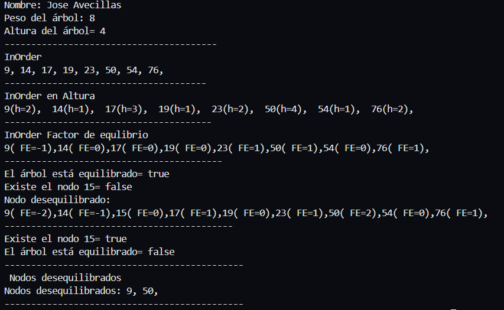

# Práctica de Algoritmos de Ordenamiento

## 📌 Información General

- **Título:** Práctica de Estructuras Lineales
- **Asignatura:** Estructura de Datos
- **Carrera:** Computación
- **Estudiante:** Jose Avecillas
- **Fecha:** 19/6/2025
- **Profesor:** Ing. Pablo Torres

---

## 🛠️ Descripción




---

## 🚀 Ejecución

Para ejecutar el proyecto:

1. Compila el código:
    ```bash
    javac App.java
    ```
2. Ejecuta la aplicación:
    ```bash
    java App
    ```

---

## 🧑‍💻 Ejemplo de Entrada relacionado con la materia 

```plaintext
Nombre: Jose Avecillas 
Peso del árbol: 8
Altura del árbol= 4
----------------------------------------
InOrder
9, 14, 17, 19, 23, 50, 54, 76,
--------------------------------------
InOrder en Altura
9(h=2),  14(h=1),  17(h=3),  19(h=1),  23(h=2),  50(h=4),  54(h=1),  76(h=2),
---------------------------------------
InOrder Factor de equlibrio
9( FE=-1),14( FE=0),17( FE=0),19( FE=0),23( FE=1),50( FE=1),54( FE=0),76( FE=1),
-----------------------------------------
El árbol está equilibrado= true
Existe el nodo 15= false
Nodo desequilibrado:
9( FE=-2),14( FE=-1),15( FE=0),17( FE=1),19( FE=0),23( FE=1),50( FE=2),54( FE=0),76( FE=1),
-------------------------------------------
Existe el nodo 15= true
El árbol está equilibrado= false
---------------------------------------------
 Nodos desequilibrados
Nodos desequilibrados: 9, 50,
---------------------------------------------

Nuevo
Imprime:
Nodo Inserado -> 5 con balance: 0
Nodo Inserado -> 20 con balance: 0
Nodo actual -> 5
        Altura -> 2
        Balance -> -1
Nodo Inserado -> 15 con balance: 0
Nodo actual -> 20
        Altura -> 2
        Balance -> 1
Nodo actual -> 5
        Altura -> 3
        Balance -> -2
Cambio
Rotacion DER en nodo: 20, con balance = 1
Nueva raiz despues de la rotacion 15
Rotacion derecha-izquierda simple a la  Izquierda
Rotacion IZQ en nodo: 5, con balance = -2
Nueva raiz despues de la rotacion 15
Nombre: Jose Avecillas
```

---

